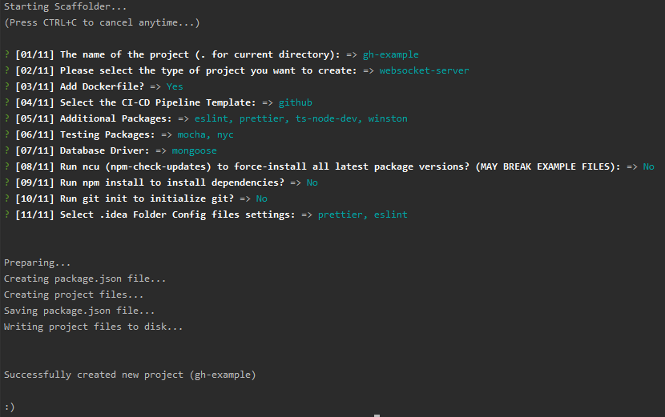
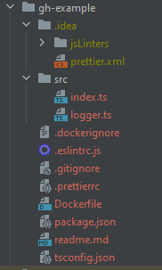

<h1 align="center">typescript-project-scaffolding</h1>

> **Summary**: This package can create a new project file and folder structure with dependencies, example files and config files which **you** have selected to your needs!


<p align="center">
  
  
</p>

> On the left is an example output if you run the script and on the right is the created folder structure.


## Usage

You can create the following project templates:
- http-api server with express
- websocket server with plain websocket
- socket.io server
- a generic npm package for publish etc.
- an empty project with no presets, just the developer dependencies

Every Project can have
- `eslint`, `prettier`, `convict`, `winston`, `joi`, `amqp`, `mqtt` configured
- as well as different test frameworks like `jest`, `mocha`,  `cypress`, `vitest` with code coverage via `nyc`
- different database dependencies can be selected: `mongoose`, `typeorm`, `mysql` / `mysql2`, `mongodb`, `redis`
- Dockerfile configuration can be created
- CI/CD templates for `github actions` and `gitlab ci` can be created


### Run:
```shell
npm init typescript-project-scaffolding
```

If there is a question:
```
Need to install the following packages:
  create-typescript-project-scaffolding
Ok to proceed? (y) 
```
=> Enter "y" to install the init-project

### The Following options can be customized:

| Question                   | Available Options                                                                                    | Default Value                                      | Description                                                                                                                                                                                                                               |
|----------------------------|------------------------------------------------------------------------------------------------------|----------------------------------------------------|-------------------------------------------------------------------------------------------------------------------------------------------------------------------------------------------------------------------------------------------|
| 1. Project-Name            | "." or any path-string                                                                               |                                                    | The Folder Name where to create the new project, use "." for the current directory (if some files already exist in the folder, you need to press Enter a few times to force use the given folder - Instructions are shown in the console) |
| 2. Project-Type            | `['http-api@express-utils', 'websocket-server', 'socket-io-server', 'npm-package', 'empty-project']` |                                                    | The Template for creating the new project, depending in this answer, custom project source files will be created                                                                                                                          |
| 3. Dockerfile              | `true` or `false`                                                                                    | `true`                                             | Add a Dockerfile to run the project as a docker container (not available if project type is `npm-package`)                                                                                                                                |
| 4. CI/CD Pipeline          | `['gitlab', 'github', 'none']`                                                                       | `github`                                           | A CI/CD Pipeline template (GitHub Actions or Gitlab Pipelines) which automatically is configured for the build and deployment of the project-type (push to NPM Registry or Docker Registry)                                               |
| 5. Additional Packages     | `['eslint', 'prettier', 'convict', 'ts-node-dev', 'winston', 'joi', 'amqp', 'mqtt']`                 | `['eslint', 'prettier', 'ts-node-dev', 'winston']` | Some dependencies which can be useful for the developer experience or for project functions (Multi-Select possible); Dependencies will be added as dependencies to `package.json` and if applicable, config files will be added           |
| 6. Testing Packages        | `['mocha', 'chai-http', 'nyc', 'cypress', 'jest', 'vitest']`                                         |                                                    | Select (multiple) dependencies used for unit/integration/end-to-end testing; Custom test npm run scripts will be added as well as example test files                                                                                      |
| 7. Database Driver         | `['mongoose', 'typeorm', 'mysql', 'mysql2', 'mongodb', 'redis']`                                     |                                                    | Select a Database dependency for a DB connection (multiple answers can be possible)                                                                                                                                                       |
| 8. latest package versions | `true` or `false`                                                                                    | `false`                                            | If `true`, the latest npm package version will be installed, otherwise an hard-coded version will be used; If `true`, it is not guaranteed that the example files will be working, because it is only tested with the hard-coded versions |
| 9. npm install             | `true` or `false`                                                                                    | `false`                                            | If `true`, the dependencies selected will be installed with `npm install`; If not, the installation step will be skipped.                                                                                                                 |
| 10. git init               | `true` or `false`                                                                                    | `false`                                            | Create a git repository in the new project folder                                                                                                                                                                                         |
| 11. `.idea/` folder files  | `['prettier', 'eslint']`                                                                             |                                                    | Copy .idea files to the destination to auto-configure IDE settings                                                                                                                                                                        |

## Reference
- npm package link: https://www.npmjs.com/package/create-typescript-project-scaffolding

## Todo
- [x] _(prio: high)_ readme (pictures, videos)
- [x] _(prio: high)_ ci/cd templates
- [ ] _(prio: none)_ testing jest/vitest etc. framework 
<!--
- [ ] _(prio: none)_ add more project templates??
-->

## 🤝 Contributing
Contributions, issues and feature requests are welcome!
Feel free to create issues here on GitHub.

----
#### Give a ⭐️ if this project helped you!

2022-2023 Trickfilm400 
